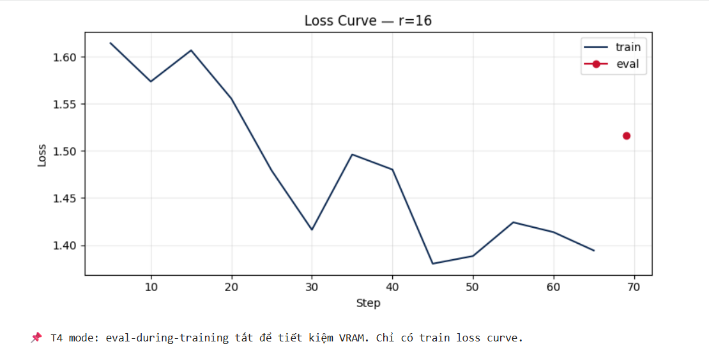

# Lab 21 — Evaluation Report

**Học viên**: Nguyễn Văn Phúc — 2A202600539
**Ngày nộp**: 2026-06-25
**Submission option**: B (HF Hub)

## 1. Setup
- **Base model**: `unsloth/Qwen2.5-3B-bnb-4bit`
- **Dataset**: `5CD-AI/Vietnamese-alpaca-gpt4-gg-translated`, 200 samples (180 train / 20 eval)
- **max_seq_length**: `1024` (p95 = `562`, rounded up to the next power of 2)
- **GPU**: Tesla T4, 15.6 GB VRAM
- **Training cost**: `$0.07` (~12.1 phút @ `$0.35`/hr cho 3 runs r=8, r=16, r=64)
- **HF Hub link**: https://huggingface.co/phucn001/lab21-qwen2.5-3b-vi-r16

## 2. Rank Experiment Results

| Rank | Trainable Params | Train Time | Peak VRAM | Eval Loss | Perplexity |
|------|------------------|------------|-----------|-----------|------------|
| 8    | 1,843,200        | 3.88 min   | 7.22 GB   | 1.5577    | 4.7479     |
| 16   | 3,686,400        | 4.31 min   | 6.62 GB   | 1.5161    | 4.5544     |
| 64   | 14,745,600       | 3.93 min   | 8.00 GB   | 1.4768    | 4.3790     |
| Base | -                | -          | -         | N/A       | N/A        |

Nhận xét nhanh: perplexity giảm đều khi tăng rank từ 8 → 16 → 64, nhưng mức cải thiện từ r=16 lên r=64 không lớn so với phần trainable parameters tăng gấp 4.

## 3. Loss Curve Analysis

- Đường train loss của cấu hình `r=16` giảm từ khoảng `1.61` xuống khoảng `1.39`, cho thấy quá trình fine-tuning hội tụ ổn định.
- Có dao động nhẹ ở giữa training (quanh step 35 và 55), nhưng xu hướng tổng thể vẫn đi xuống, không có dấu hiệu loss bùng nổ hay diverge.
- Điểm eval cuối cùng nằm quanh `1.516`, cao hơn train loss cuối, nghĩa là có generalization gap như thường thấy; tuy nhiên chưa đủ bằng chứng để kết luận overfitting mạnh.
- Trong notebook T4, eval-during-training đã bị tắt để tiết kiệm VRAM, nên báo cáo này chỉ có 1 điểm eval sau khi train xong. Vì vậy, kết luận hợp lý là model học được tín hiệu từ dataset và chưa xuất hiện dấu hiệu bất ổn rõ ràng, nhưng chưa thể theo dõi overfitting chi tiết theo từng giai đoạn.

## 4. Qualitative Comparison (5 examples)

### Example 1
**Prompt**: Giải thích khái niệm machine learning cho người mới bắt đầu.
**Base**: Mô tả khá dài, mở đầu đúng hướng nhưng diễn đạt lan man và bị cắt giữa câu.
**Fine-tuned (r=16)**: Giải thích rõ hơn rằng machine learning là một phần của AI, học từ dữ liệu để đưa ra dự đoán, câu trả lời mạch lạc hơn.
**Nhận xét**: Improved. Bản fine-tuned định nghĩa gọn và dễ hiểu hơn cho người mới bắt đầu.

### Example 2
**Prompt**: Viết đoạn code Python tính số Fibonacci thứ n.
**Base**: Trả lời bằng code đệ quy/vòng lặp nhưng snippet bị dừng sớm và xử lý biên chưa tốt.
**Fine-tuned (r=16)**: Đưa ra hàm Python dùng vòng lặp với `a, b = 0, 1`, có xử lý input âm bằng `ValueError`.
**Nhận xét**: Improved. Câu trả lời cụ thể hơn, thực dụng hơn và phong cách gần với mẫu instruction-tuning.

### Example 3
**Prompt**: Liệt kê 5 nguyên tắc thiết kế UI/UX.
**Base**: Có ý đúng nhưng phần diễn đạt khá dài dòng và mục liệt kê chưa sắc nét.
**Fine-tuned (r=16)**: Trả lời theo dạng liệt kê ngắn gọn hơn như chuyển đổi, thích ứng, đơn giản, tương thích.
**Nhận xét**: Same to slightly improved. Format tốt hơn nhưng nội dung chưa sâu, vẫn hơi chung chung.

### Example 4
**Prompt**: Tóm tắt sự khác biệt giữa LoRA và QLoRA.
**Base**: Nhận diện đúng hai khái niệm nhưng giải thích chưa chính xác, còn mơ hồ và bị cắt cụt.
**Fine-tuned (r=16)**: Vẫn trả lời trôi chảy hơn nhưng nội dung còn sai lệch khi diễn giải LoRA như một dạng regularization.
**Nhận xét**: Degraded / not improved meaningfully. Đây là ví dụ cho thấy fine-tuning trên dataset general instruction không tự động sửa được kiến thức chuyên môn.

### Example 5
**Prompt**: Phân biệt prompt engineering, RAG, và fine-tuning.
**Base**: Trả lời được ý chính nhưng câu văn dài và thiếu cấu trúc.
**Fine-tuned (r=16)**: Cấu trúc tốt hơn, mở đầu rõ ràng rằng đây là ba kỹ thuật khác nhau trong AI và tự động hóa.
**Nhận xét**: Improved. Fine-tuned model có xu hướng trả lời theo format giải thích/phân biệt rõ ràng hơn.

## 5. Conclusion về Rank Trade-off

Trên dataset Vietnamese Alpaca 200 mẫu này, rank `16` cho ROI tốt nhất. So với `r=8`, rank `16` giảm eval loss từ `1.5577` xuống `1.5161` và perplexity từ `4.7479` xuống `4.5544`, trong khi thời gian train chỉ tăng nhẹ từ `3.88` lên `4.31` phút. Đây là mức đánh đổi hợp lý vì chất lượng tăng rõ ràng nhưng chi phí compute và số trainable parameters vẫn còn khá gọn. Rank `64` cho perplexity tốt nhất (`4.3790`), nhưng trainable parameters tăng lên `14,745,600`, gấp 4 lần `r=16`, còn chất lượng chỉ cải thiện thêm một khoảng nhỏ. Điều này cho thấy diminishing returns đã bắt đầu xuất hiện khi tăng từ `16` lên `64`: model vẫn tốt hơn, nhưng tốc độ cải thiện chậm hơn rất nhiều so với mức tăng tài nguyên.

Nếu deploy production cho bài toán tương tự, mình sẽ chọn `r=16`. Lý do là nó cân bằng tốt giữa chất lượng, chi phí huấn luyện, và độ đơn giản khi vận hành. `r=8` hơi tiết kiệm nhưng chất lượng thấp hơn thấy rõ, còn `r=64` phù hợp hơn khi dataset lớn hơn hoặc bài toán đòi hỏi format/style rất chặt. Ngoài ra, phần qualitative cũng cho thấy fine-tuned `r=16` giúp câu trả lời gọn hơn, có cấu trúc hơn, nhưng chưa đủ để sửa các lỗi kiến thức nền của base model; vì vậy tăng rank không phải lúc nào cũng là cách hiệu quả nhất nếu bản chất vấn đề nằm ở dữ liệu hoặc domain knowledge.

## 6. What I Learned
- Chỉ tăng rank thôi chưa chắc mang lại cải thiện tương xứng; cần nhìn đồng thời perplexity, qualitative output, và số trainable parameters để chọn cấu hình hợp lý.
- Fine-tuning giúp model trả lời đúng format và mạch lạc hơn, nhưng không thay thế cho dữ liệu chất lượng hoặc kiến thức domain chuyên sâu.
- Trên GPU T4, việc tắt eval giữa chừng và dùng `safe_evaluate()` là cách thực tế để hoàn thành thí nghiệm mà vẫn giữ được số liệu đủ tốt cho báo cáo.
- Qualitative evaluation rất quan trọng vì perplexity không phản ánh đầy đủ độ đúng kiến thức và độ tự nhiên của câu trả lời; trong kết quả hiện tại có trường hợp model fine-tuned viết mạch lạc hơn nhưng vẫn diễn giải sai khái niệm LoRA/QLoRA.
---
